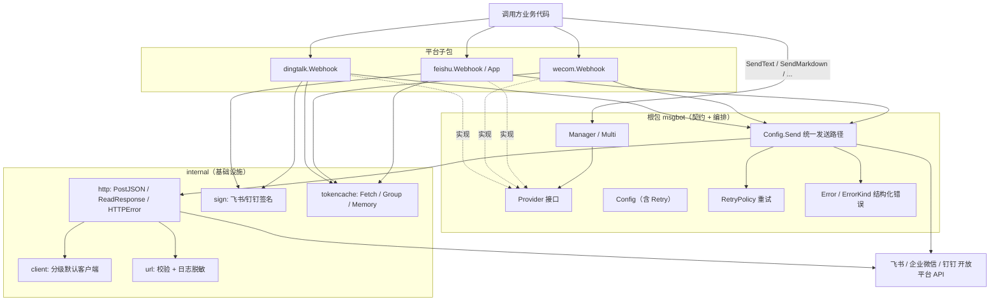
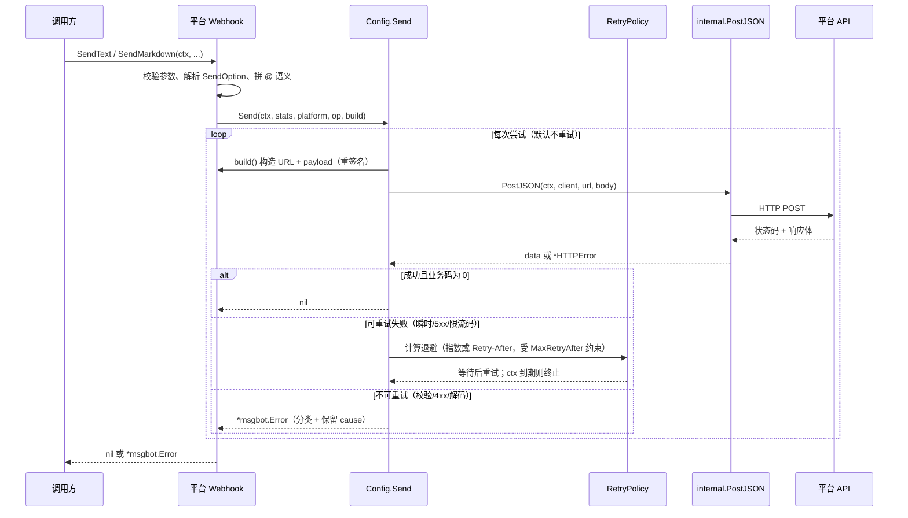
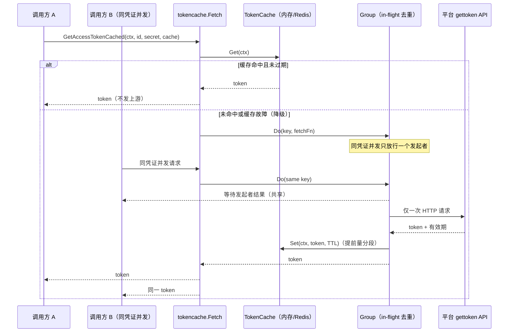
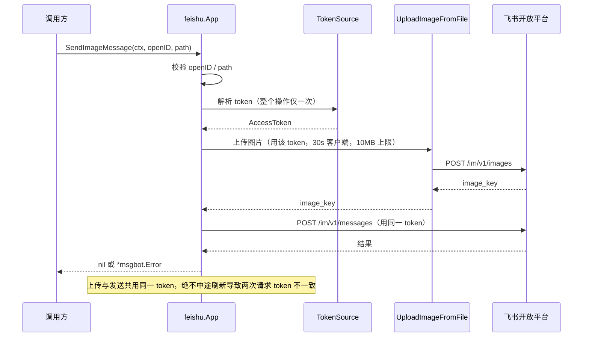
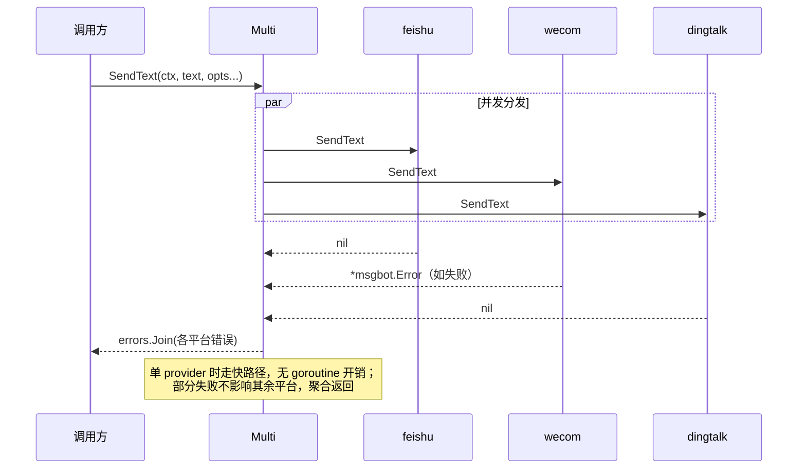

# msgbot 架构文档

> 本文档为项目内部参考资料，**不纳入版本控制**（通过 `.git/info/exclude` 本地排除）。
> 描述 `github.com/gtkit/msgbot` 的目录结构、整体架构与关键流程时序。
> 面向维护者，随代码演进可自行更新。

`msgbot` 是多平台 IM 机器人消息推送 Go 库，支持飞书（Feishu）、企业微信（WeCom）、钉钉（DingTalk）。核心设计：一个平台无关的根包定义统一契约与共享能力，三个平台子包实现各自协议，`internal` 承载不对外暴露的实现细节。

---

## 一、目录结构与职责

```
github.com/gtkit/msgbot
├── provider.go            根包核心：Provider 接口、Platform、Config、SendOption、Response、Stats、Logger
├── manager.go             Multi（并发广播）与 Manager（多平台注册/默认选择）
├── dispatch.go            Config.Send —— 三平台 webhook 共用的统一发送路径（Provider 扩展 API）
├── retry.go               RetryPolicy —— 可选重试（默认关闭），指数退避 + jitter + Retry-After
├── errors.go              结构化错误 Error / ErrorKind，及分类器与限流码表
├── richtext.go            RichTextToMarkdown —— 富文本向 markdown 的降级转换
├── version.go             版本常量
│
├── feishu/                飞书子包
│   ├── webhook.go         Webhook Provider（text / markdown 卡片 / post 富文本 / image）+ @ 语义
│   ├── app.go             自建应用消息客户端 App（TokenSource 可刷新 token）
│   ├── auth.go            GetAccessToken、AccessToken、DownloadImage
│   ├── image.go           图片上传（含 10MB 上限）
│   └── tokencache.go      TokenCache 接口、MemoryTokenCache、GetAccessTokenCached
│
├── wecom/                 企业微信子包（webhook.go / auth.go / image.go / tokencache.go）
│   └── image.go           base64+md5 图片（含 2MB 上限）
│
├── dingtalk/              钉钉子包（webhook.go / auth.go / image.go / tokencache.go）
│   └── webhook.go         额外支持 Link / ActionCard / FeedCard；签名走 URL query
│
└── internal/             不对外暴露的实现细节
    ├── http.go            PostJSON、ReadResponse、结构化 HTTPError（body 截断）
    ├── client.go          分级默认 HTTP 客户端（消息 10s / 图片 30s）、PickClient
    ├── sign.go            FeishuSign、DingTalkSignedURL（net/url 处理 query）
    ├── url.go             URL 校验与日志脱敏（URLOriginForLog、SanitizeRequestError）
    └── tokencache/        token 缓存泛型核心
        ├── tokencache.go  Fetch —— 读穿透 + TTL 分段 + 故障降级
        ├── group.go       Group —— in-flight 去重（防冷启动击穿）
        └── memory.go      Memory —— 基于 atomic.Pointer 的零锁进程内缓存
```

### 分层职责

| 层 | 位置 | 职责 |
|---|---|---|
| 契约层 | `provider.go` | 定义 `Provider` 统一接口、`Config`、发送选项、结构化错误载体 |
| 编排层 | `manager.go`、`dispatch.go`、`retry.go` | 多平台注册与广播、统一发送路径、重试策略 |
| 平台层 | `feishu/`、`wecom/`、`dingtalk/` | 各平台协议实现、消息类型、@ 语义、token 与图片 |
| 基础层 | `internal/` | HTTP 收发、签名、URL 脱敏、token 缓存泛型核心 |

依赖方向自上而下单向：平台层依赖契约层与基础层；基础层不反向依赖任何上层；`internal/tokencache` 泛型核心不感知具体平台类型。

---

## 二、整体架构图



要点：

- 三平台的 webhook 发送最终都汇聚到 `Config.Send`，由它统一处理**重试、结构化错误分类、统计、日志脱敏**，避免各平台重复实现。
- `Config.Send` 每次尝试通过 `BuildRequest` 回调重新构造请求，使时间敏感的签名（钉钉时间戳、飞书 sign）在每次重试时刷新。
- token 缓存的编排逻辑集中在 `internal/tokencache`，三平台仅提供各自的 `AccessToken` 类型与获取函数。

---

## 三、关键流程时序图

### 3.1 Webhook 发送（含重试与结构化错误）



### 3.2 带缓存获取 access token（读穿透 + 并发去重）



### 3.3 飞书自建应用发送图片消息（单操作单 token）



### 3.4 多平台广播（Multi 尽力而为）



---

## 四、几个设计约束（阅读代码前须知）

- **重试默认关闭**：`RetryPolicy` 零值不重试，保持单次发送语义；开启后投递为 at-least-once，可能重复。
- **@ 语义按平台差异实现**：飞书文本 `<at user_id>`、卡片 `<at id>`；企微 `mentioned_list`（markdown 无法 @ 指定人，静默降级）；钉钉正文注入 `@手机号` + `atMobiles`。
- **结构化错误覆盖**：webhook 发送、token 获取、飞书图片上传/下载与 App 消息返回 `*msgbot.Error`；纯本地文件/系统错误仍为普通 error。
- **日志脱敏**：webhook 路径/query/签名不入日志，仅记 `scheme://host`；`HTTPError` 响应体在错误串中截断。
- **并发安全**：Provider 构造后不可变；`Manager` 默认平台经 atomic 可变；`TokenSource` 要求实现方并发安全。
- **依赖**：JSON 用 `github.com/gtkit/json/v2`；日志不绑定具体库（`Config.Logger` 为最小接口）。
